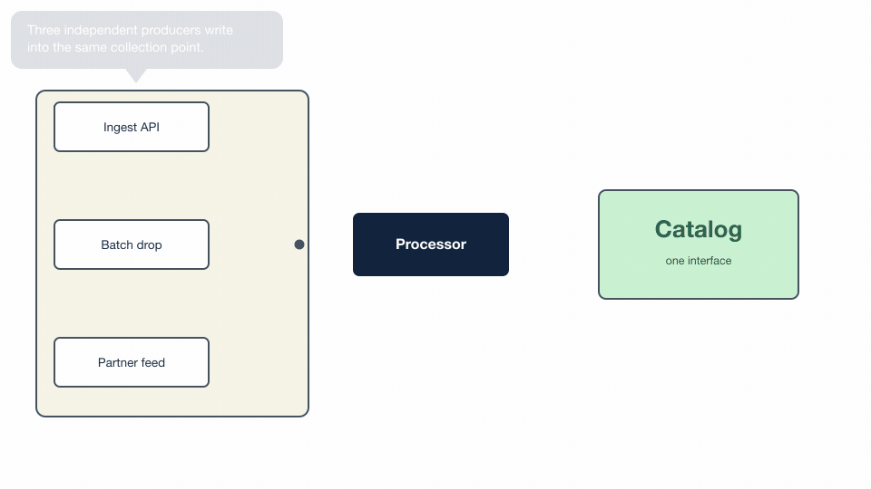
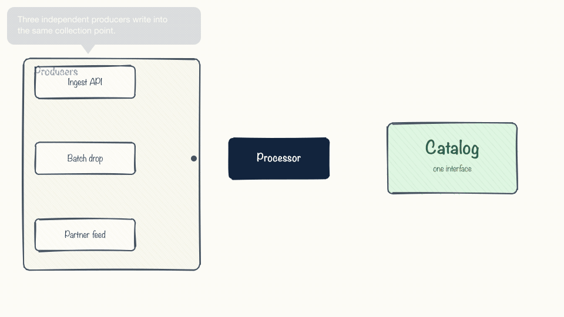

# svg-flow-animator

Build animated diagram GIFs by generating SVG frames.

Describe a diagram once as coordinates, emit one standalone SVG per frame,
rasterise with librsvg, assemble with ffmpeg. The output drops straight into
Google Slides, Keynote, or a README and animates on its own.

Zero Python dependencies — stdlib only.



Same diagram, same code, `--style=sketch`:



## Why frames instead of SMIL/CSS

Animated SVG is smaller and sharper, and it is also useless in the places these
diagrams actually get shown. Google Slides, Keynote, PowerPoint and GitHub
READMEs will not run SMIL or CSS animation. A GIF plays everywhere with no
plugin, no embed, and no upload step.

Generating discrete frames also means every frame is a real file you can open,
diff, and eyeball — which matters a lot when something renders wrong at frame
417 and nowhere else.

## Install

```bash
git clone https://github.com/kyle-lesinger/svg-flow-animator
cd svg-flow-animator
```

Two external binaries:

```bash
brew install librsvg ffmpeg     # rsvg-convert, ffmpeg
```

## The pieces

| Module | What it does |
| --- | --- |
| `assets` | Recovers artwork from a flattened design-tool export — embedded base64 rasters, and vector marks identified by fill colour |
| `geometry` | Polyline maths, easing, and collision-aware label placement |
| `svg` | Element emitters. String-based; frames are write-once |
| `timeline` | `Stage` objects, flow connectors, pulses, auto-placed callouts |
| `render` | Parallel rasterisation and GIF assembly |
| `overrides` | Hand-tunable geometry, and the handle registry the editor reads |
| `editor` | Generates a browser editor from that registry — for any project, not one diagram |
| `styles` | `FLAT` and `SKETCH` drawing backends behind one interface |
| `rough` | Excalidraw-style sketchy geometry (a port of roughjs) |

## Quick shape

```python
from svg_flow_animator import assets, render, svg, timeline

# 1. recover the real artwork instead of screenshotting a render
found = assets.extract_rasters("diagram-export.svg", "assets/")

# 2. describe the beats. `anchor` is what the caption is ABOUT --
#    where it gets drawn is derived from that.
stages = [
    timeline.Stage("sources", start=8,   dur=60, anchor=(150, 450),
                   text="Data arrives from many locations..."),
    timeline.Stage("ingest",  start=132, dur=30, anchor=(419, 450),
                   text="Every source converges on one ingest UI."),
]

# 3. emit frames
for f in range(TOTAL):
    body = static_scene()
    for st in stages:
        p = st.progress(f)
        if p >= 0:
            body += timeline.flow(PATH, p, f * 7.0, "#008a0e", "#ff7a00")
        body += timeline.callout(st, st.alpha(f), OBSTACLES, (1600, 900))
    open(f"frames/f{f:04d}.svg", "w").write(svg.document(1600, 900, body, "#fff"))

# 4. render and assemble
render.stage_assets("assets/", "frames/")
render.render_frames("frames/", 1600, 900)
render.build_gif("frames/", "out.gif", fps=15, width=1280, height=720)
```

See `examples/disasters_ingest/` for a complete, working diagram.

## Moving things by hand

Coordinates that should be tweakable go through `overrides` instead of being
hardcoded:

```python
from svg_flow_animator import overrides as ov
ov.use("overrides.json")

HUB   = ov.point("hub", (318, 450), "ingest hub")
STAC  = ov.rect("box.stac", (660, 350, 280, 200), "STAC")
LINK  = ov.path("flow.ingest_to_stac", [(500, 450), (660, 450)], "Ingest -> STAC")
```

Two things fall out of that one indirection. A JSON file can now nudge any of
it without touching code — and because every request is *registered*, a
generated editor can discover what is movable and draw a handle for it. Adding
a new movable thing means adding one `ov.*` call; the editor picks it up for
free.

`ov.path()` is the interesting one: **inserting a vertex is how a straight
connector becomes an angled one**, so line angles are editable without any
special-casing.

`ov.point()` can also name a scalar that controls its size, and the editor
turns that into a resize grip on the handle rather than a numeric field to go
hunting for:

```python
ICON   = ov.point("node.airflow", (550, 450), "Airflow", size_key="node.airflow.size")
ICON_W = ov.scalar("node.airflow.size", 48, "Airflow size")
```

## The editor comes for free

`editor.build()` reads that registry and writes one self-contained HTML file.
It knows nothing about any particular diagram — hand it the canvas size and a
callback that draws the current picture, and every handle the layout registered
gets a drag target:

```python
from svg_flow_animator import editor

editor.build("editor.html", (960, 540),
             backdrop=lambda: svg.document(960, 540, static_scene(), "#fff"),
             title="my diagram")
```

The backdrop callback returns an SVG document (rasterised for you with
`rsvg-convert`), or PNG bytes, or a `(source, background)` pair. Pass a **dict**
of callbacks and the editor grows a switcher between named views over the same
handles — which is how one `overrides.json` drives both a flat and a hand-drawn
render of the same diagram:

```python
editor.build("editor.html", (960, 540), title="my diagram", backdrop={
    "Flat":       lambda: (scene_svg(styles.FLAT),   styles.FLAT.bg),
    "Hand-drawn": lambda: (scene_svg(styles.SKETCH), styles.SKETCH.bg),
})
```

Drag to move; grab a container by its dashed border; double-click a connector
to add a bend point and right-click one to remove it; ⌘Z / ⌘⇧Z undo and redo
200 levels; toggle whole layers off when handles overlap. Handles are grouped
in a side panel with numeric fields, and only what differs from the defaults is
written out.

`python3 examples/minimal/demo.py --editor` builds one for the minimal example,
which is 20 handles and no artwork at all. `examples/disasters_ingest/` has the
full-size version, plus a `serve.py` that re-renders the real diagram live as
you drag.

One gotcha: `ov.path()` only registers when the function owning it is *called*,
and connector functions normally run during frame generation. An editor must
call them once up front or it will show no bendable lines at all.

## Hand-drawn mode

`styles.SKETCH` renders the same scene in an Excalidraw-like hand-drawn style:
roughjs-style double strokes, hachure fills, and a handwriting face. Draw
through `S.box`/`S.text`/`S.poly` instead of the raw emitters and both styles
come for free.

```python
from svg_flow_animator import styles
S = styles.select()                  # --style=sketch, or FLOWGIF_STYLE=sketch
body = S.box(40, 100, 300, 360, "#f6f4e8", stroke="#46525e", rx=10)
```

**It costs almost nothing.** Sketch geometry is ~6x the SVG bytes but only
**+3%** on the final GIF, because the extra ink is identical in every frame and
inter-frame compression absorbs it.

**The one thing you must get right is determinism.** Seed the jitter from each
shape's *identity*, never from the frame number, and give every shape its own
PRNG. A shared random stream re-jitters everything downstream the moment a flow
appears or disappears, and the whole diagram visibly boils. `rough.seed_for()`
uses `zlib.crc32`, not `hash()` — `hash()` is salted per process, so it would
give you different artwork on every run.

Fonts: Excalidraw's own face is Excalifont (SIL OFL). If it is not installed the
stack falls back through Noteworthy and Chalkboard SE. End the stack with
`sans-serif`, **not** `cursive` — on macOS `cursive` resolves to Zapfino.

## Things that will bite you

A few of the non-obvious ones, all handled by the library. The full catalogue is
**[docs/GOTCHAS.md](docs/GOTCHAS.md)** — every entry there is a silent failure
that shipped once, and they share a shape: the code runs, exits zero, and
produces a plausible-looking wrong result.

**librsvg will not load images outside the document's own directory.** A frame
in `frames/` cannot reference `../assets/logo.png`. It fails *silently* — the
image simply does not draw, no warning, no error, exit code 0. `stage_assets()`
mirrors your sprite directory below the frame directory so hrefs resolve.

**librsvg's filter support is poor.** `feGaussianBlur` will not give you a glow.
Stack a few concentric strokes at decreasing opacity instead — `svg.glow()`
does this.

**`preserveAspectRatio="meet"` shrinks things you expected to fill.** A 1.4:1
logo in a 188×74 slot gets pinned to 104×74 by height, not width. If you want
several differently-shaped images to fill equal frames uniformly, use `slice`.

**Colour-keying a background can eat your whites.** Knocking out `#fbf0ff` at
8% fuzz also removes white, because they differ by only 5.9%. Keep the fuzz
below the distance between the background and the lightest colour you care about.

**Hold frames are nearly free.** Consecutive identical frames collapse under the
GIF inter-frame delta, so generous pauses cost almost nothing. Motion is what
costs bytes.

**Don't paint flow dashes before the reveal finishes.** Packets appearing on
track the head has not reached yet is the tell that the motion is faked.
`timeline.flow()` sequences the two phases for you.

**`fill:transparent` still eats clicks.** In SVG a transparent fill is painted,
so it receives pointer events exactly like an opaque one. A container rect over
a group of nodes swallows every click meant for them and nothing inside can be
selected. `fill:none` plus a fat transparent stroke with
`pointer-events:stroke` gives a grab band on the border and leaves the interior
click-through — which is what the editor does for containers.

**Re-rendering during `pointerdown` kills the drag.** Rebuilding an overlay to
show the new selection destroys the element you just grabbed, and its
`pointermove` listener goes with it — so the thing never moves and there is no
error to explain why. Move handles in place during the gesture and re-render
once, on release.

**Keep generated JS in a raw Python string.** A `"\n"` inside a normal
triple-quoted template survives Python's own parsing as a real newline, lands
in the middle of a JS string literal, and the unterminated literal takes the
whole script down — a blank page with one console error. `node --check` on the
extracted `<script>` catches it in a second.

## Design notes

**Callouts place themselves.** Hand-picking a slot per caption looks fine until
the layout moves. `geometry.place_near()` sweeps for the nearest position to the
subject that collides with nothing, and the tail leaves from whichever edge
actually faces it. A stage declares *what it is about*; where the bubble goes is
derived.

Give `timeline.callout()` a *sequence* of widths and it tries the widest first.
A wider bubble wraps to fewer lines, so it is shorter, and a short bubble fits
strips a tall one cannot — trying wide first is what lets a caption slot into
the gap above a container instead of being shoved into a corner. Past
`tail_max` (260px by default) the tail is dropped altogether: a pointer
spanning half the canvas stops reading as "this describes that" and just looks
like a stray arrow.

**Extract artwork, don't screenshot it.** Design-tool exports hide real assets
in `<defs>` as base64. `assets.extract_rasters()` gets them back byte-exact at
native resolution, which beats cropping a render every time. For vector marks,
`extract_paths_by_fill()` finds them by brand colour so they stay vector and can
be rotated.

**ffmpeg over ImageMagick for the GIF.** `palettegen` with `stats_mode=diff`
weights the palette toward pixels that actually change between frames — for a
mostly-static diagram that spends the colour budget where it shows.

## Docs

- **[docs/GOTCHAS.md](docs/GOTCHAS.md)** — silent failures, ranked by what they cost
- [docs/ARCHITECTURE.md](docs/ARCHITECTURE.md) — module map, the handle registry, timing, placement
- [docs/DECISIONS.md](docs/DECISIONS.md) — why things are the way they are, including measurements that contradicted the hypothesis
- [CLAUDE.md](CLAUDE.md) / [.clinerules.md](.clinerules.md) — guidance for AI assistants

## License

MIT
